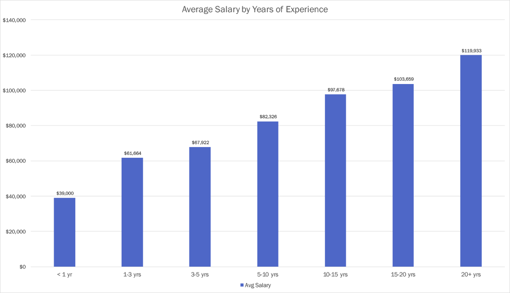
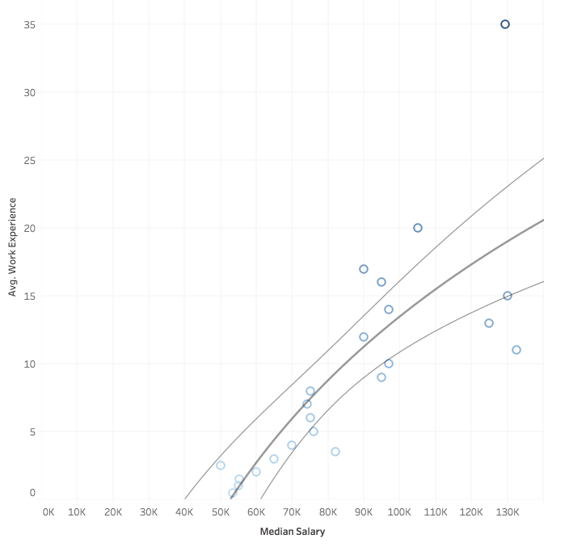
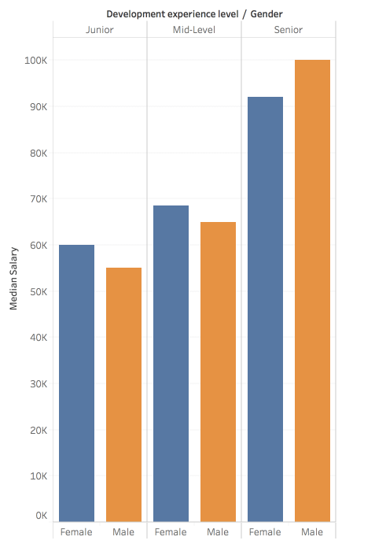
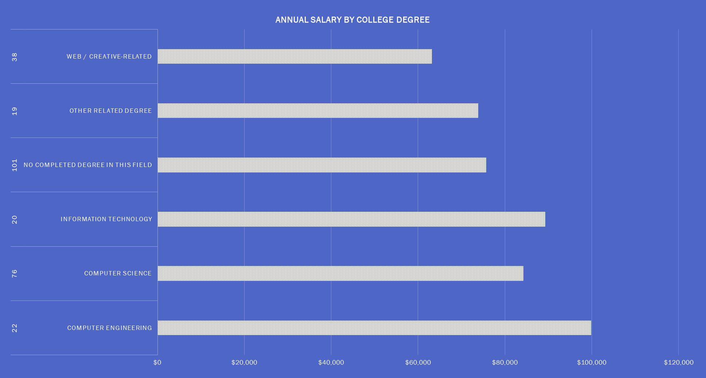
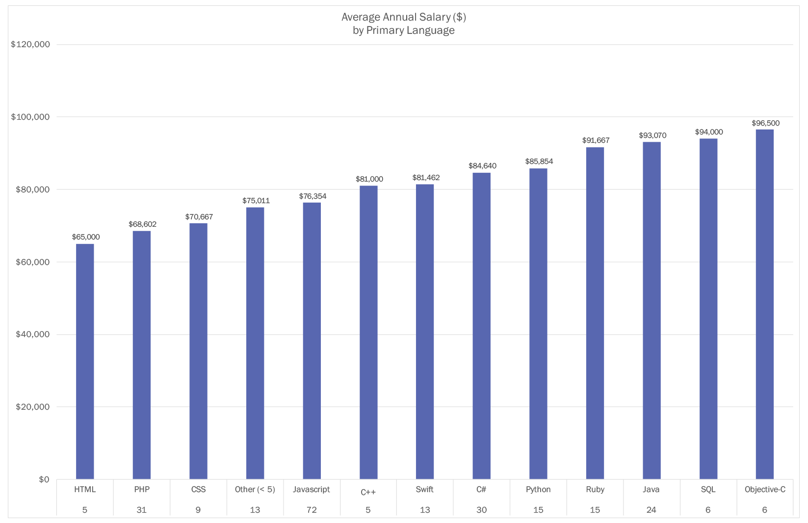
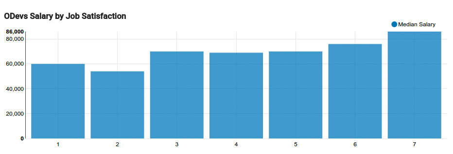
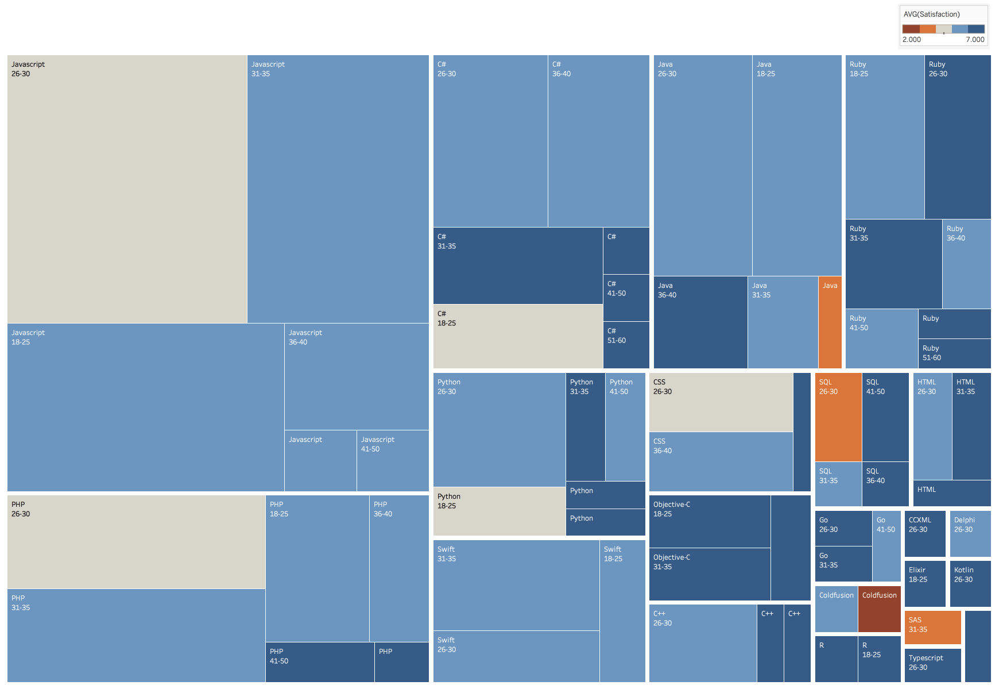
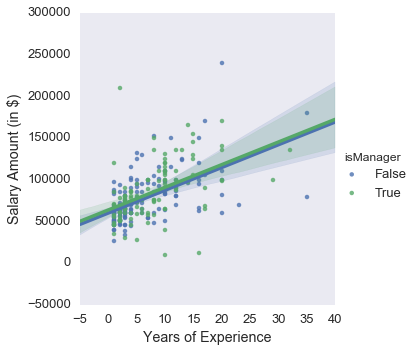
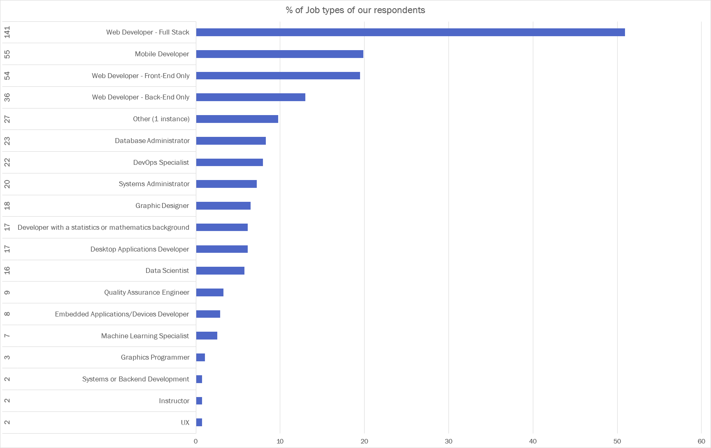
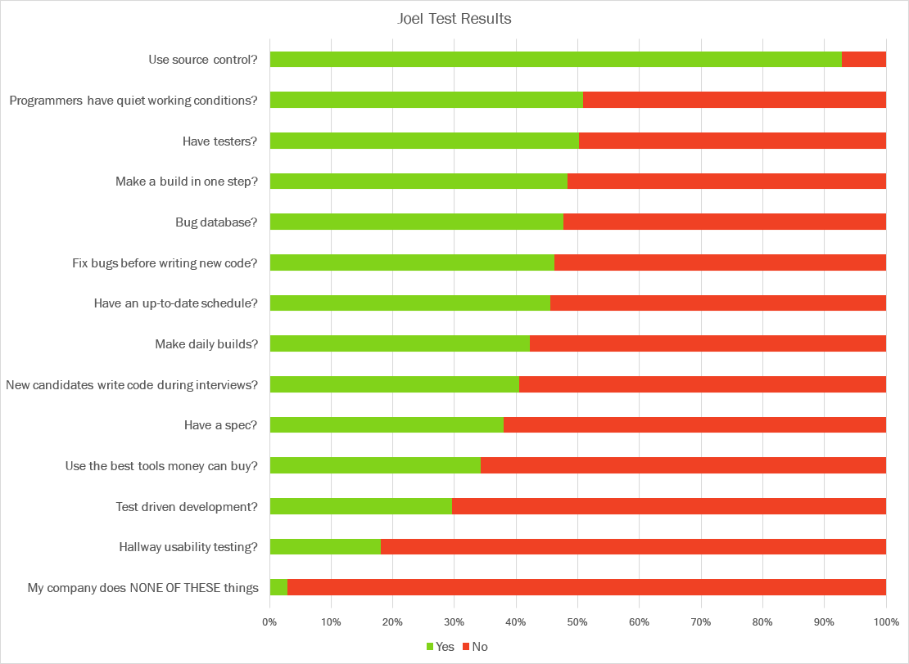

The Orlando Devs Community exists to improve the quality of life of developers in Orlando. One of the ways that we're able to do that is by informing our community what is a fair wage in our local economy, independent of where one's skillset or years of experience is.

The Orlando Devs Annual Salary Survey has become an yearly tradition, and in 2017 we had 277 developers fill out the survey (a higher number [than our 2016 survey](/blog/orlando-devs-salaries-in-2016/)).

---

## Compensation and Experience

The following charts show us that in average, the longer you've been in our industry, the higher your compensation. It is really encouraging to know that our industry compensates professionals according to their experience and level of contribution they bring to the table.

The following visualization excludes some outliers, but still tells the same story as our previous one: in general the longer you've been around, the more you get paid.

**What this means to you:** The future still looks bright in our industry, given its track record. And that is true if whether you are just starting out or have been in this for a while.

---

## Compensation and Gender

The following chart was a pleasant surprise to all of us: **women are starting our in our field with a higher compensation than men**. This was surprising because we constantly hear reports that our industry tends to pay men more than women even when there is a comparable experience; but not in this community. 😊

The story changes, however, with senior-level jobs as men are still getting paid more for those jobs.

**What this means to you:** Regardless of gender, **now** is a great time to get started with development.

---

## Annual Salary By College Degree

Do developers need a college degree to do well in their careers? The following graph shows that having a degree certainly helps you make more money over time. But it's not a must, as self-taught developers are not too far behind pay-wise.

Also, most of our survey respondents do not have a college degree in this field (101 people), followed by Computer Science grads (76 people) and so on.

**What this means to you:** If you have the opportunity, then you should certainly pursue a college degree. But developers in our community who do not have one are still doing just fine.

---

## Annual Salary by Primary Coding Language

Does a developer's programming language of choice have an impact on their pay? The following graph shows us that the answer is _yes_ 🎊 🎉.

All in all, it's a great time to be alive as an iOS developer, though it makes one wonder if it's another case of supply & demand since there are only 19 iOS developers (Swift and Objective-C combined) versus say 24 for Java or even 72 for JavaScript.

**What this means to you:** There honestly isn't a huge difference of pay between languages. At the end of the day, do what you enjoy as that will have the biggest payout at the end. Also be willing to be flexible and have a diverse background, as being able to where multiple hats will always be super valuable.

---

## Compensation By Satisfaction

The <a href="https://www.joelonsoftware.com/2000/08/09/the-joel-test-12-steps-to-better-code/" target="_blank">Joel Test</a> is an assesment to indicate the quality of a software team. The following chart indicates how the teams of our survey respondents are doing as far as the Joel Test is concerned.

**What this means to you:** It is in your best interest to either introduce some of these concepts to your team, or join a team that takes advantage of these concepts next time you look for a new job. In theory, the more you take advantage of these practices the better software professional you'll become.

---

## Popularity of Languages and Satisfaction Amongst Age Groups

Our next chart shows us that JavaScript is the most popular programming language in our community, followed by PHP, C# and so on.

The other interesting piece of information in this visualization is that people in the age group of 26-30 are pretty unhappy no matter what they're working on (millenials, ya know 🙃). Except for Ruby, as it seems to make all age groups happy.

**What this means to you:** Age appears to have some influence in the type of stack you'd be happier in. While you can't decide to be a happy 50 year old C# developer, you can avoid being the unhappy 20 year old who wants to learn their first stack by not selecting C# and something that is popular amongst your peers.

---

## Compensation and People Management

Is it true that developers need to become managers to finally have a breakthrough in income? According to the following chart, that **does not seem to be the case** in our community.

**What this means to you:** Managing people is rewarding in many ways, but one should never do it when just pursuing more money. That doesn't seem to work within our community.

---

## Question Results

Following are the results for each of the questions asked on our survey.

### Section 1: Developer Current Work Details (Required)

**Question 1:** Primary Coding Language Used

**Question 2:** Secondary Coding Language Used

**Question 3:** Primary Framework/Platform Used

**Question 4:** Secondary Framework/Platform Used

**Question 5:** Which of the following best describe you?

**Question 6:** Which parts of the Joel Test does your development work environment pass?

**Question 7:** Managers: How many direct reports do you have?

**Question 8:** Total number of developers at your company

